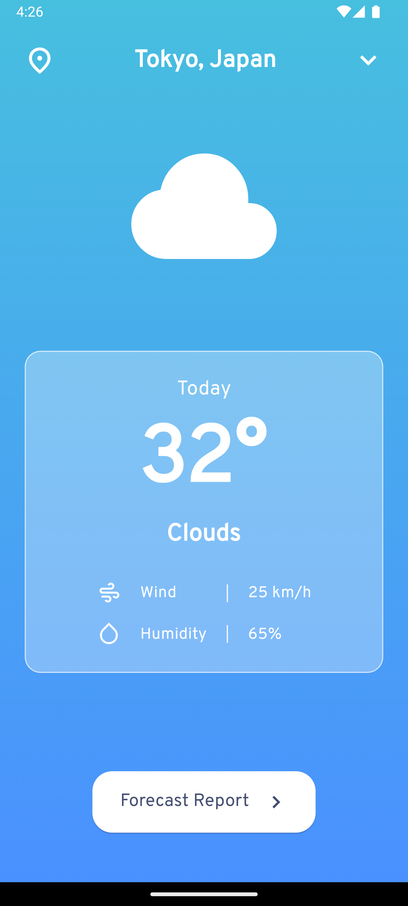

# TruongThoWeather

A Flutter-based weather forecast application that provides real-time weather updates, including current conditions and forecasts for upcoming days. The app uses OpenWeather API to fetch data and supports location search with OpenCage Geocoding API. It features a responsive and user-friendly interface, including dynamic weather icons and smooth transitions.

## Features

- **Real-Time Weather Data**: Fetches real-time weather data, including temperature, humidity, and wind speed.
- **Hourly & Daily Forecast**: Displays a detailed forecast for the day and upcoming days.
- **Dynamic Weather Icons**: Shows weather icons based on the current and forecasted weather conditions.
- **Location Search**: Allows users to search for locations.

## Screenshots

<div style="display: flex; justify-content: space-around;">
  
  
</div>

## Technologies Used

- **Flutter**: Frontend framework for building cross-platform mobile applications.
- **OpenWeather One Call API 3.0**: Provides real-time weather data and forecasts.
- **OpenCage Geocoding API**: Enables location search functionality.
- **Stacked Architecture**: Utilizes Stacked for better state management.

## Installation

### Prerequisites

- **Flutter SDK**: [Flutter Installation Guide](https://flutter.dev/docs/get-started/install)
- **API Keys**:
   - OpenWeather (You also need a billing plan for One Call API 3.0): [OpenWeather API](https://openweathermap.org/api/one-call-3)
   - OpenCage Geocoding API: [OpenCage API](https://opencagedata.com/api)

### Steps

1. Clone the repository:

    ```bash
    git clone https://github.com/TruongTho3345/weather_forecast.git
    ```

2. Navigate to the project directory:

    ```bash
    cd weather_forecast
    ```

3. Install dependencies:

    ```bash
    flutter pub get
    flutter pub run build_runner build --delete-conflicting-outputs 
    ```

4. Navigate to a `lib/constant/api_constants.dart` file and add your API keys for OpenWeather and Google Places API. For example:

    ```
    class ApiConstants {
      static const String apiOpenWeather = '123456789';
      static const String apiGeocoding = '987654321';
    }
    ```

5. Run the app on a connected device or simulator:

    ```bash
    flutter run
    ```

## Usage

- On launch, the app will display the current weather and forecast for your location.
- Use the search bar to find the weather for different locations.
- Scroll horizontally to view the hourly forecast and vertically for the next few days’ forecast.
